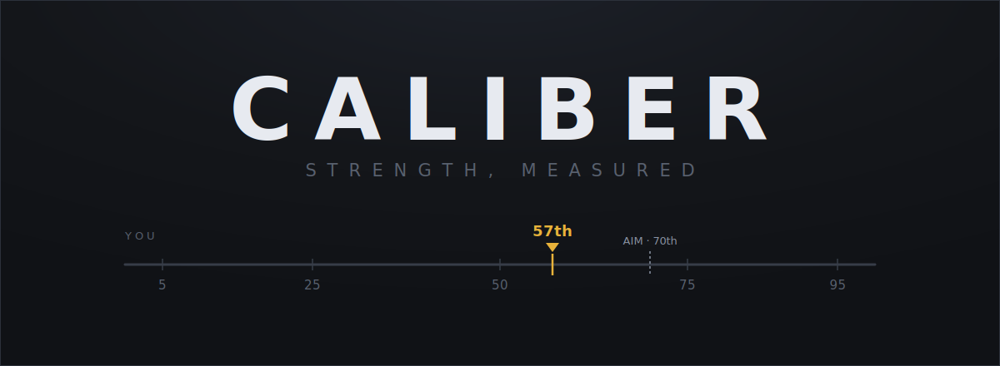

  

  <strong>Strength, measured.</strong> 
  A single-file, offline strength gauge — percentile rankings, 1RM estimation, and reverse rep/weight calculators for the powerlifts and weighted pull-ups.

  <a href="https://lorenzdm93.github.io/Caliber-Strength-Gym-Calculator/"><strong>▶ Run it in your browser</strong></a>

  
  
  
  
  

---

## What it is

Caliber is a strength tracker that lives in **one HTML file**. Enter a set — reps × weight — for bench, squat, deadlift, or weighted pull-ups, and it estimates your one-rep max, shows where that sits on a bodyweight-based **percentile gauge**, tracks progress toward your goals, and tells you exactly what it would take to close the gap.

No account, no server, no build step, no tracking. Open the file and go. Everything you type stays in your browser, on your device.

## Use it

- **Run it live** — open **[the hosted version](https://lorenzdm93.github.io/Caliber-Strength-Gym-Calculator/caliber.html)** in any browser, including mobile.
- **Download the file** — open [`caliber.html`](caliber.html), then click the **Download raw file** button (the ⬇ icon at the top-right of the file view). Double-click it to open in your browser — works fully offline.
- **Clone it** — `git clone https://github.com/Lorenzdm93/Caliber-Strength-Gym-Calculator.git`, then open `caliber.html`.

Your sets, goals, and history are saved in that browser's local storage.

> **Tip:** on a phone, open it and *Add to Home Screen* for one-tap access at the gym.

## Features

- **1RM estimate** from any set — Epley formula with a Brzycki cross-check, plus a confidence flag that warns when high reps make the estimate unreliable.
- **Percentile gauge** — an engraved scale showing where your estimated max lands among lifters at your bodyweight, with your target marked.
- **Goals** — set automatically from a percentile you choose (e.g. *top 30%*), or override any lift with your own number.
- **Reverse calculators** — *"at this weight, how many reps hit my goal?"* and *"at this many reps, what weight proves it?"*
- **History** — best-ever per lift, a progress sparkline, and your recent sets. Designed for sporadic logging.
- **kg / lb** toggle · four lifts: bench, squat, deadlift, weighted pull-up.

## How the numbers work

- **Estimates** use Epley — `weight × (1 + reps ÷ 30)` — most accurate at ~5 reps or fewer. Past ~10 reps they drift high, which the confidence dot flags.
- **Percentiles and goals** are keyed to **bodyweight**, using approximate distributions aggregated from public lifter data for **adult males**. Height is recorded for context (BMI) but isn't a percentile axis — no reliable dataset segments lifts by height.
- **"Top X%"** maps to the matching percentile (top 10% → 90th percentile). Your goal for a lift is the weight that would place you there, rounded to the nearest 2.5.
- **Weighted pull-ups** are computed on the full system load (bodyweight + added weight), then reported as the added weight — so enter only the weight hanging from the belt.

Example — the built-in preset for a 183 cm / 80 kg lifter aiming for the **top 30%**:

| Lift | Goal 1RM |
| :--- | :--- |
| Bench press | 115 kg |
| Squat | 155 kg |
| Deadlift | 180 kg |
| Weighted pull-up | +47.5 kg |

## Privacy

No accounts, no analytics, no network calls. Everything lives in your browser's local storage. Wipe it any time with the **Erase all saved data** button (under *How the numbers work* in the app).

## Accuracy and limitations

The standards are approximations for orientation, not competition-grade percentiles, and are calibrated for adult males. Rep-based 1RM estimates are least reliable for high-rep sets and for lifters returning after a layoff. Treat the numbers as a compass, not a scale.

## Built with

Plain HTML, CSS, and JavaScript in a single ~31 KB file. No frameworks, no dependencies, no build. Works in any modern browser, fully offline.

## License

[MIT](LICENSE) — do whatever you like, no warranty.
